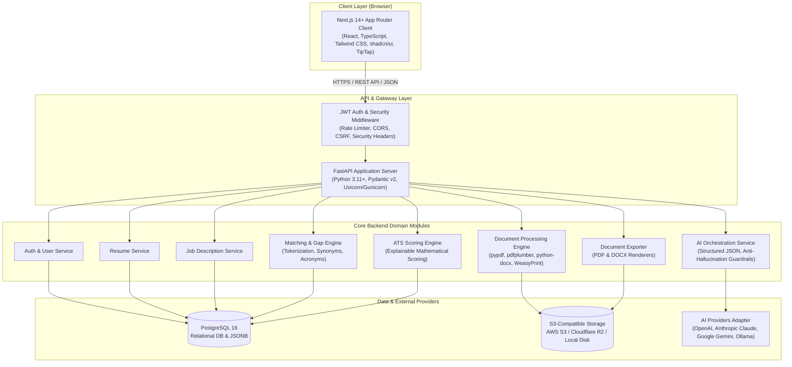
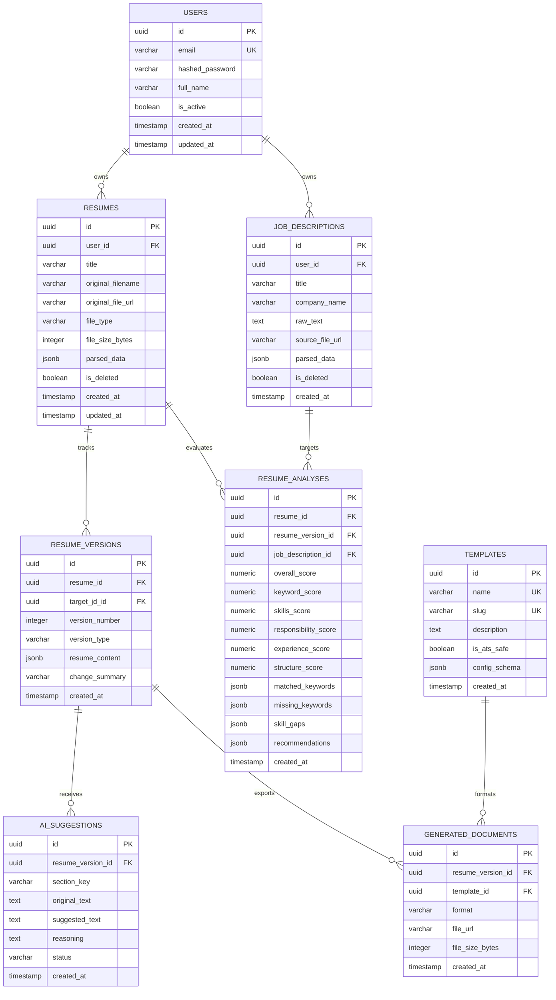
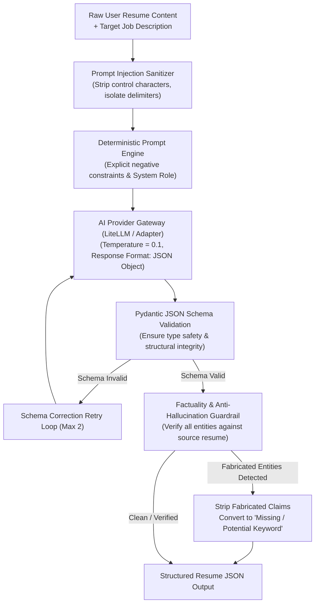
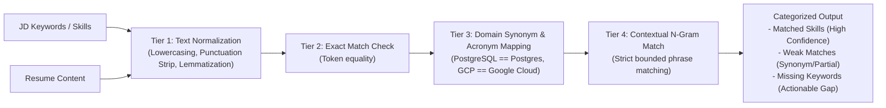
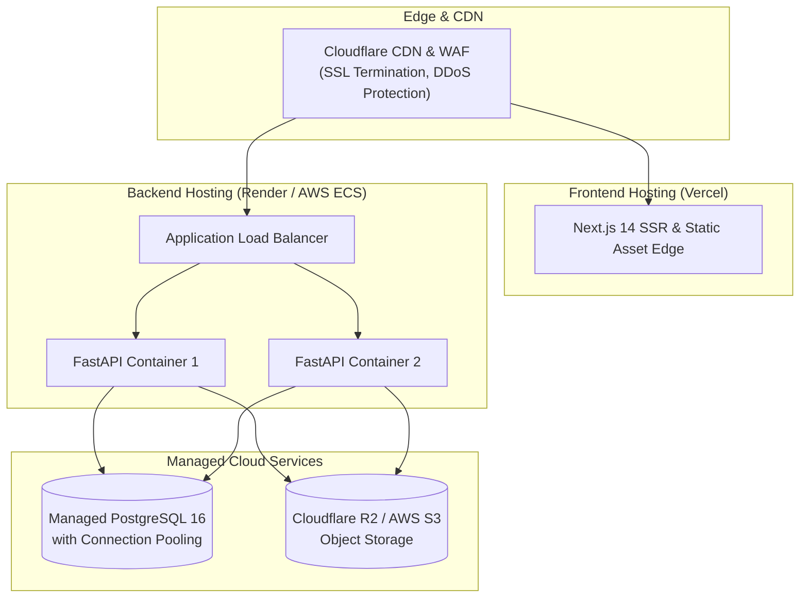

# 03_SYSTEM_ARCHITECTURE.md — System Architecture Document

## ResumeForge AI — AI-Powered ATS Resume Optimization & Job Matching Platform

**Version:** 1.0.0  
**Date:** 2026-08-24  
**Status:** Approved  
**Author:** Software Architecture & Engineering Team  

---

## 1. Architecture Overview

ResumeForge AI is designed as a **modular monolith** optimized for rapid developer velocity, strict data consistency, high maintainability, and predictable operational costs during MVP and early scaling.

The architecture decouples the frontend client from backend domain logic via a strongly-typed RESTful API contract. It isolates external AI providers, document processing engines, and file storage behind clean interface adapters.

### High-Level System Architecture Diagram



### Architectural Principles

1. **Modular Monolith First:** Single deployable backend service with strict internal module boundaries, enabling simple local development and seamless future extraction into microservices if needed.
2. **Stateless API:** The backend retains zero in-memory session state. All requests carry JWT tokens or session cookies verified against database-backed revocation lists, enabling effortless horizontal auto-scaling.
3. **Provider Agnosticism:** AI operations interact solely with an abstract `AIProviderBase` interface. Switching between OpenAI, Anthropic, Google Gemini, or local models requires zero modifications to business logic.
4. **Relational-First Data Model:** Core domain entities use strict relational integrity with foreign keys, indexes, and timestamps. Semi-structured extracted sections use PostgreSQL `JSONB` with strict Pydantic schema validation.
5. **No Hallucination by Design:** AI prompts operate under strict deterministic temperature constraints ($T \le 0.2$), explicit negative constraints, and schema enforcement to prevent experience fabrication.

---

## 2. Component Breakdown

| Component | Technology | Responsibility |
|---|---|---|
| **Frontend Web App** | Next.js 14+ (App Router), TypeScript, Tailwind CSS, shadcn/ui | User interface, state management, rich-text document editing (TipTap), real-time ATS feedback display, responsive views. |
| **API Gateway / Server** | FastAPI, Uvicorn, Pydantic v2 | Routing, schema validation, rate limiting, authentication/authorization, error serialization. |
| **Document Processing** | `pdfplumber`, `pypdf`, `python-docx` | Text extraction, layout heuristic analysis, structural metadata parsing from raw binary uploads. |
| **Matching & Gap Engine** | Python NLP (spaCy / NLTK tokenizers, custom synonym dictionary) | Keyword normalization, exact/synonym matching, acronym expansion, skill gap calculation. |
| **ATS Scoring Engine** | Pure Python deterministic scoring module | Calculates weighted ATS compatibility score (0–100) across 5 explainable categories. |
| **AI Orchestration** | LangChain / LiteLLM / Custom Provider Layer | Structured JSON generation, prompt templating, token budget management, anti-hallucination verification. |
| **Export Engine** | `WeasyPrint` / `Jinja2` (PDF), `python-docx` (DOCX) | Template-based ATS-optimized document compilation and rendering. |
| **Relational Database** | PostgreSQL 16 | ACID transactions, user management, resume versioning, analysis histories, suggestion logs. |
| **Object Storage** | S3 API / MinIO / Local FS | Encrypted storage of raw uploaded files and compiled exported documents. |

---

## 3. Backend Structure

```text
backend/
├── alembic/                      # Database migration scripts
│   ├── versions/                 # Individual migration files
│   └── env.py                    # Alembic environment configuration
├── app/
│   ├── __init__.py
│   ├── main.py                   # FastAPI application factory & router mounting
│   ├── api/                      # API Layer (Routers & Endpoints)
│   │   ├── __init__.py
│   │   ├── deps.py               # Dependency injection (DB session, current user)
│   │   └── v1/                   # API Version 1 Routers
│   │       ├── __init__.py
│   │       ├── auth.py           # /auth endpoints (register, login, refresh, logout)
│   │       ├── users.py          # /users endpoints (profile, password, account deletion)
│   │       ├── resumes.py        # /resumes endpoints (upload, list, get, delete, parse)
│   │       ├── job_descriptions.py # /job-descriptions endpoints (upload, paste, list, get)
│   │       ├── analyses.py       # /analyses endpoints (trigger, get results)
│   │       ├── ai.py             # /ai endpoints (optimize section, rewrite bullet)
│   │       ├── versions.py       # /resumes/{id}/versions endpoints (history, restore, diff)
│   │       └── exports.py        # /exports endpoints (generate PDF/DOCX, download)
│   ├── core/                     # Core system configuration & security
│   │   ├── __init__.py
│   │   ├── config.py             # Pydantic Settings (env vars, secrets, thresholds)
│   │   ├── security.py           # Password hashing (bcrypt), JWT generation/validation
│   │   ├── exceptions.py         # Custom domain exception classes
│   │   └── logging.py            # Structured JSON logger configuration
│   ├── db/                       # Database session & base definitions
│   │   ├── __init__.py
│   │   ├── base.py               # SQLAlchemy declarative base
│   │   └── session.py            # Async/Sync engine and sessionmaker factories
│   ├── models/                   # SQLAlchemy ORM Data Models
│   │   ├── __init__.py
│   │   ├── user.py               # User table definition
│   │   ├── resume.py             # Resume table definition
│   │   ├── resume_version.py     # ResumeVersion table definition
│   │   ├── job_description.py    # JobDescription table definition
│   │   ├── resume_analysis.py    # ResumeAnalysis table definition
│   │   ├── ai_suggestion.py      # AISuggestion table definition
│   │   ├── template.py           # ResumeTemplate table definition
│   │   └── generated_document.py # GeneratedDocument table definition
│   ├── schemas/                  # Pydantic Schemas (DTOs / Request & Response models)
│   │   ├── __init__.py
│   │   ├── user.py
│   │   ├── resume.py
│   │   ├── job_description.py
│   │   ├── analysis.py
│   │   ├── ai.py
│   │   ├── version.py
│   │   └── export.py
│   ├── services/                 # Domain Business Logic Services
│   │   ├── __init__.py
│   │   ├── auth_service.py
│   │   ├── user_service.py
│   │   ├── resume_service.py
│   │   ├── jd_service.py
│   │   ├── analysis_service.py
│   │   └── export_service.py
│   ├── repositories/             # Database Access Layer (CRUD abstraction)
│   │   ├── __init__.py
│   │   ├── base_repository.py
│   │   ├── user_repository.py
│   │   ├── resume_repository.py
│   │   ├── jd_repository.py
│   │   └── analysis_repository.py
│   ├── parsers/                  # Raw Document Parsing Engine
│   │   ├── __init__.py
│   │   ├── base_parser.py        # Abstract parser interface
│   │   ├── pdf_parser.py         # PDF text & structure extractor
│   │   ├── docx_parser.py        # DOCX text & XML structure extractor
│   │   └── section_extractor.py  # Regex & heuristic section segmenter
│   ├── matching/                 # Keyword & Skills Matching Engine
│   │   ├── __init__.py
│   │   ├── normalizer.py         # Token normalizer, lemmatization, cleanups
│   │   ├── synonyms.py           # Tech & skill synonym dictionary (Postgres == PostgreSQL)
│   │   ├── acronyms.py           # Acronym mapping engine (GCP == Google Cloud Platform)
│   │   └── matcher.py            # Exact & normalized skill gap comparator
│   ├── ats/                      # ATS Scoring Engine
│   │   ├── __init__.py
│   │   ├── calculator.py         # Mathematical scoring formulas (40/25/20/10/5 weights)
│   │   └── explainability.py     # Breakdown and actionable improvement generator
│   ├── ai/                       # AI Layer & Provider Abstraction
│   │   ├── __init__.py
│   │   ├── base.py               # Abstract AIProviderBase interface
│   │   ├── openai_provider.py    # OpenAI GPT-4o / GPT-4o-mini implementation
│   │   ├── anthropic_provider.py # Anthropic Claude 3.5 Sonnet implementation
│   │   ├── gemini_provider.py    # Google Gemini 1.5 Pro/Flash implementation
│   │   ├── ollama_provider.py    # Local Ollama Llama 3 / Mistral implementation
│   │   ├── factory.py            # AI provider factory selector
│   │   ├── prompts.py            # System prompts with anti-hallucination rules
│   │   └── guardrails.py         # AI response factuality verification & schema validator
│   ├── exporters/                # PDF & DOCX Generation Engine
│   │   ├── __init__.py
│   │   ├── base_exporter.py
│   │   ├── pdf_exporter.py       # HTML/CSS to PDF renderer via WeasyPrint
│   │   ├── docx_exporter.py      # python-docx ATS template builder
│   │   └── templates/            # HTML/CSS & DOCX template files
│   └── storage/                  # Object Storage Abstraction
│       ├── __init__.py
│       ├── base_storage.py       # Abstract storage interface
│       ├── local_storage.py      # Local filesystem adapter (dev)
│       └── s3_storage.py         # S3/R2 boto3 adapter (production)
├── tests/                        # Automated Test Suites
│   ├── conftest.py               # Pytest fixtures & test DB setup
│   ├── unit/                     # Unit tests (parsers, matching, ATS, AI prompts)
│   ├── integration/              # Integration tests (API endpoints, DB transactions)
│   └── e2e/                      # End-to-end user workflow simulations
├── pyproject.toml                # Poetry / UV dependency configuration
└── Dockerfile                    # Production multi-stage Dockerfile
```

---

## 4. Frontend Architecture

The frontend is structured using Next.js 14+ App Router with a **feature-sliced module organization**, keeping UI components, state hooks, and API queries co-located with their respective business domain.

```text
frontend/
├── app/                          # Next.js App Router (Routing & Pages)
│   ├── layout.tsx                # Root layout (Theme, Providers, Global Toaster)
│   ├── page.tsx                  # Landing page (Hero, Features, Live ATS Demo, Pricing)
│   ├── (auth)/                   # Authentication Route Group (Clean layout without sidebar)
│   │   ├── login/page.tsx
│   │   ├── register/page.tsx
│   │   └── forgot-password/page.tsx
│   ├── (dashboard)/              # Authenticated User App Route Group (With App Navigation)
│   │   ├── layout.tsx            # Dashboard shell (Sidebar, Header, User Menu)
│   │   ├── dashboard/page.tsx    # Dashboard home (Recent Resumes, Recent Analyses, CTAs)
│   │   ├── resumes/
│   │   │   ├── page.tsx          # Resume List & Management
│   │   │   ├── new/page.tsx      # Multi-step wizard: Upload Resume -> Add JD -> Analyze
│   │   │   └── [id]/
│   │   │       ├── page.tsx      # Analysis Overview & Score Breakdown
│   │   │       ├── edit/page.tsx # 3-Panel Main Resume Editor
│   │   │       └── preview/page.tsx # Full Document Preview & Export
│   │   └── settings/page.tsx     # User Profile & Preferences
├── components/                   # Shared UI Components
│   ├── ui/                       # shadcn/ui Primitives (Button, Dialog, Dropdown, Input, etc.)
│   ├── layout/                   # Navbar, Sidebar, Footer, Breadcrumbs
│   ├── feedback/                 # ErrorBoundary, SkeletonLoader, EmptyState, Toast
│   └── document/                 # ATS Score Gauge, KeywordBadge, DiffViewer
├── features/                     # Feature-Driven Business Modules
│   ├── auth/                     # LoginForm, RegisterForm, AuthHooks, AuthContext
│   ├── resume-upload/            # DropzoneUploader, ParsingProgressModal, UploadValidations
│   ├── jd-input/                 # JDTextInput, JDUploader, KeywordPreview
│   ├── analysis/                 # ATSScoreCard, KeywordMatchList, SkillGapTable, ActionCards
│   ├── editor/                   # TipTapEditor, SectionNav, AISuggestionBox, HistoryDrawer
│   │   ├── extensions/           # Custom TipTap marks/nodes (AI highlight, keyword pill)
│   │   ├── components/           # SectionCard, BulletItem, InlineAISuggestion
│   │   └── hooks/                # useEditorAutosave, useEditorHistory, useLiveATS
│   ├── templates/                # TemplateSelector, TemplateThumbnail, StyleCustomizer
│   └── export/                   # ExportModal, ATSValidationChecklist, DownloadButton
├── hooks/                        # Global Custom React Hooks
│   ├── use-debounce.ts
│   ├── use-media-query.ts
│   └── use-local-storage.ts
├── lib/                          # Utility functions and configurations
│   ├── api-client.ts             # Axios / Fetch wrapper with auto JWT token refresh
│   ├── constants.ts              # System limits, supported formats, score thresholds
│   ├── utils.ts                  # Tailwind clsx/twMerge helper, string formatters
│   └── validations/              # Zod validation schemas for forms
├── services/                     # Typed API Request Services
│   ├── auth.service.ts
│   ├── resume.service.ts
│   ├── jd.service.ts
│   ├── analysis.service.ts
│   ├── ai.service.ts
│   └── export.service.ts
├── types/                        # TypeScript Interface Definitions
│   ├── api.d.ts                  # Generic API Response & Error schemas
│   ├── auth.d.ts                 # User, Token, Session interfaces
│   ├── resume.d.ts               # StructuredResume, Section, Experience, Skill types
│   ├── analysis.d.ts             # ATSScore, MatchedKeyword, SkillGap, Recommendation
│   └── editor.d.ts               # EditorState, HistoryNode, AISuggestionItem
└── styles/
    └── globals.css               # Tailwind directives & CSS custom properties
```

---

## 5. Database Design (PostgreSQL Relational Schema)

### Entity-Relationship Diagram (ERD)



### Table Definitions & DDL Specifications

#### 1. `users`
```sql
CREATE TABLE users (
    id UUID PRIMARY KEY DEFAULT gen_random_uuid(),
    email VARCHAR(255) NOT NULL UNIQUE,
    hashed_password VARCHAR(255) NOT NULL,
    full_name VARCHAR(150),
    is_active BOOLEAN NOT NULL DEFAULT TRUE,
    created_at TIMESTAMPTZ NOT NULL DEFAULT CURRENT_TIMESTAMP,
    updated_at TIMESTAMPTZ NOT NULL DEFAULT CURRENT_TIMESTAMP
);

CREATE INDEX idx_users_email ON users(email);
```

#### 2. `resumes`
```sql
CREATE TABLE resumes (
    id UUID PRIMARY KEY DEFAULT gen_random_uuid(),
    user_id UUID NOT NULL REFERENCES users(id) ON DELETE CASCADE,
    title VARCHAR(255) NOT NULL,
    original_filename VARCHAR(255) NOT NULL,
    original_file_url VARCHAR(1024) NOT NULL,
    file_type VARCHAR(10) NOT NULL, -- 'pdf', 'docx'
    file_size_bytes INTEGER NOT NULL,
    parsed_data JSONB NOT NULL,     -- Structured JSON matching StructuredResume schema
    is_deleted BOOLEAN NOT NULL DEFAULT FALSE,
    created_at TIMESTAMPTZ NOT NULL DEFAULT CURRENT_TIMESTAMP,
    updated_at TIMESTAMPTZ NOT NULL DEFAULT CURRENT_TIMESTAMP
);

CREATE INDEX idx_resumes_user_id ON resumes(user_id) WHERE is_deleted = FALSE;
CREATE INDEX idx_resumes_created_at ON resumes(created_at DESC);
```

#### 3. `job_descriptions`
```sql
CREATE TABLE job_descriptions (
    id UUID PRIMARY KEY DEFAULT gen_random_uuid(),
    user_id UUID NOT NULL REFERENCES users(id) ON DELETE CASCADE,
    title VARCHAR(255),
    company_name VARCHAR(255),
    raw_text TEXT NOT NULL,
    source_file_url VARCHAR(1024),
    parsed_data JSONB NOT NULL,     -- Structured JSON matching ParsedJobDescription schema
    is_deleted BOOLEAN NOT NULL DEFAULT FALSE,
    created_at TIMESTAMPTZ NOT NULL DEFAULT CURRENT_TIMESTAMP
);

CREATE INDEX idx_job_descriptions_user_id ON job_descriptions(user_id) WHERE is_deleted = FALSE;
```

#### 4. `resume_versions`
```sql
CREATE TABLE resume_versions (
    id UUID PRIMARY KEY DEFAULT gen_random_uuid(),
    resume_id UUID NOT NULL REFERENCES resumes(id) ON DELETE CASCADE,
    target_jd_id UUID REFERENCES job_descriptions(id) ON DELETE SET NULL,
    version_number INTEGER NOT NULL,
    version_type VARCHAR(30) NOT NULL, -- 'original', 'ai_generated', 'user_edited'
    resume_content JSONB NOT NULL,     -- Full editable snapshot of the resume structure
    change_summary VARCHAR(500),
    created_at TIMESTAMPTZ NOT NULL DEFAULT CURRENT_TIMESTAMP,
    CONSTRAINT uq_resume_version UNIQUE(resume_id, version_number)
);

CREATE INDEX idx_resume_versions_resume_id ON resume_versions(resume_id);
```

#### 5. `resume_analyses`
```sql
CREATE TABLE resume_analyses (
    id UUID PRIMARY KEY DEFAULT gen_random_uuid(),
    resume_id UUID NOT NULL REFERENCES resumes(id) ON DELETE CASCADE,
    resume_version_id UUID NOT NULL REFERENCES resume_versions(id) ON DELETE CASCADE,
    job_description_id UUID NOT NULL REFERENCES job_descriptions(id) ON DELETE CASCADE,
    overall_score NUMERIC(5, 2) NOT NULL,        -- 0.00 to 100.00
    keyword_score NUMERIC(5, 2) NOT NULL,        -- 0.00 to 100.00 (40% weight)
    skills_score NUMERIC(5, 2) NOT NULL,         -- 0.00 to 100.00 (25% weight)
    responsibility_score NUMERIC(5, 2) NOT NULL, -- 0.00 to 100.00 (20% weight)
    experience_score NUMERIC(5, 2) NOT NULL,     -- 0.00 to 100.00 (10% weight)
    structure_score NUMERIC(5, 2) NOT NULL,      -- 0.00 to 100.00 (5% weight)
    matched_keywords JSONB NOT NULL,             -- Array of matched keyword objects
    missing_keywords JSONB NOT NULL,             -- Array of missing keyword objects with warnings
    skill_gaps JSONB NOT NULL,                   -- Categorized gap analysis
    recommendations JSONB NOT NULL,              -- Actionable improvement suggestions
    created_at TIMESTAMPTZ NOT NULL DEFAULT CURRENT_TIMESTAMP
);

CREATE INDEX idx_analyses_resume_version ON resume_analyses(resume_version_id);
CREATE INDEX idx_analyses_jd ON resume_analyses(job_description_id);
```

#### 6. `ai_suggestions`
```sql
CREATE TABLE ai_suggestions (
    id UUID PRIMARY KEY DEFAULT gen_random_uuid(),
    resume_version_id UUID NOT NULL REFERENCES resume_versions(id) ON DELETE CASCADE,
    section_key VARCHAR(100) NOT NULL,           -- e.g., 'experience[0].bullets[2]'
    original_text TEXT NOT NULL,
    suggested_text TEXT NOT NULL,
    reasoning TEXT NOT NULL,
    status VARCHAR(20) NOT NULL DEFAULT 'pending', -- 'pending', 'accepted', 'rejected'
    created_at TIMESTAMPTZ NOT NULL DEFAULT CURRENT_TIMESTAMP
);

CREATE INDEX idx_suggestions_version ON ai_suggestions(resume_version_id);
```

#### 7. `templates`
```sql
CREATE TABLE templates (
    id UUID PRIMARY KEY DEFAULT gen_random_uuid(),
    name VARCHAR(100) NOT NULL UNIQUE,
    slug VARCHAR(50) NOT NULL UNIQUE,
    description TEXT,
    is_ats_safe BOOLEAN NOT NULL DEFAULT TRUE,
    config_schema JSONB NOT NULL DEFAULT '{}',
    created_at TIMESTAMPTZ NOT NULL DEFAULT CURRENT_TIMESTAMP
);
```

#### 8. `generated_documents`
```sql
CREATE TABLE generated_documents (
    id UUID PRIMARY KEY DEFAULT gen_random_uuid(),
    resume_version_id UUID NOT NULL REFERENCES resume_versions(id) ON DELETE CASCADE,
    template_id UUID NOT NULL REFERENCES templates(id) ON DELETE RESTRICT,
    format VARCHAR(10) NOT NULL,                 -- 'pdf', 'docx'
    file_url VARCHAR(1024) NOT NULL,
    file_size_bytes INTEGER NOT NULL,
    created_at TIMESTAMPTZ NOT NULL DEFAULT CURRENT_TIMESTAMP
);

CREATE INDEX idx_generated_docs_version ON generated_documents(resume_version_id);
```

---

## 6. API Design (RESTful Contract)

All API responses follow standard JSON serialization formats with uniform status structures.

### Standard Response Schemas

#### Success Envelope
```json
{
  "success": true,
  "data": { ... },
  "meta": {
    "timestamp": "2026-08-24T12:00:00Z",
    "request_id": "req_abc123"
  }
}
```

#### Error Envelope
```json
{
  "success": false,
  "error": {
    "code": "VALIDATION_ERROR",
    "message": "File exceeds maximum allowable size of 10MB.",
    "details": [
      {
        "field": "file",
        "issue": "File size 12.4MB > 10.0MB limit"
      }
    ]
  }
}
```

### Complete Endpoint Registry

| Method | Endpoint | Auth | Purpose | Request Body | Success Response | Error Codes |
|---|---|---|---|---|---|---|
| `POST` | `/api/v1/auth/register` | None | Create user account | `UserRegisterRequest` | `201 Created` + User DTO | `400`, `409`, `422` |
| `POST` | `/api/v1/auth/login` | None | Authenticate user & issue tokens | `UserLoginRequest` | `200 OK` + Access Token & Set Cookie | `401`, `422`, `429` |
| `POST` | `/api/v1/auth/refresh` | Cookie | Rotate and refresh access token | None (Reads refresh cookie) | `200 OK` + New Access Token | `401`, `403` |
| `POST` | `/api/v1/auth/logout` | JWT | Invalidate user session | None | `200 OK` + Clear Cookie | `401` |
| `GET` | `/api/v1/users/me` | JWT | Get current user profile | None | `200 OK` + User Profile DTO | `401`, `404` |
| `POST` | `/api/v1/resumes` | JWT | Upload raw resume file (PDF/DOCX) | `multipart/form-data` | `201 Created` + Resume DTO | `400`, `413`, `415`, `422` |
| `GET` | `/api/v1/resumes` | JWT | List user resumes | Query params: `page`, `limit` | `200 OK` + Paginated List | `401` |
| `GET` | `/api/v1/resumes/{id}` | JWT | Get single resume by ID | Path: `id` | `200 OK` + Full Resume DTO | `401`, `403`, `404` |
| `DELETE` | `/api/v1/resumes/{id}` | JWT | Soft delete resume | Path: `id` | `200 OK` | `401`, `403`, `404` |
| `POST` | `/api/v1/job-descriptions` | JWT | Create/upload target JD | `multipart/form-data` OR `JSON` | `201 Created` + JD DTO | `400`, `413`, `422` |
| `GET` | `/api/v1/job-descriptions/{id}` | JWT | Get parsed JD details | Path: `id` | `200 OK` + Full JD DTO | `401`, `403`, `404` |
| `POST` | `/api/v1/analyses` | JWT | Trigger ATS compatibility analysis | `CreateAnalysisRequest` | `201 Created` + Analysis DTO | `400`, `404`, `500` |
| `GET` | `/api/v1/analyses/{id}` | JWT | Get analysis results & breakdown | Path: `id` | `200 OK` + Analysis Breakdown DTO | `401`, `403`, `404` |
| `POST` | `/api/v1/resumes/{id}/optimize` | JWT | Generate AI-optimized resume | `OptimizeResumeRequest` | `200 OK` + New ResumeVersion DTO | `400`, `404`, `504` |
| `POST` | `/api/v1/ai/improve-section` | JWT | Rewrite specific bullet or section | `ImproveSectionRequest` | `200 OK` + AISuggestion DTO | `400`, `422`, `500` |
| `GET` | `/api/v1/resumes/{id}/versions` | JWT | List version history for resume | Path: `id` | `200 OK` + Version List DTO | `401`, `403`, `404` |
| `POST` | `/api/v1/resumes/{id}/versions` | JWT | Save new version from editor state | `SaveVersionRequest` | `201 Created` + Version DTO | `400`, `404`, `422` |
| `POST` | `/api/v1/resumes/{id}/restore/{version_id}` | JWT | Restore previous version | Path: `id`, `version_id` | `200 OK` + Version DTO | `401`, `403`, `404` |
| `POST` | `/api/v1/exports/pdf` | JWT | Compile & render PDF | `ExportDocumentRequest` | `200 OK` + Download URL DTO | `400`, `404`, `500` |
| `POST` | `/api/v1/exports/docx` | JWT | Compile & render DOCX | `ExportDocumentRequest` | `200 OK` + Download URL DTO | `400`, `404`, `500` |

---

## 7. AI Layer Architecture & Anti-Hallucination Guardrails



### 1. Abstract AI Provider Interface (`app/ai/base.py`)
```python
from abc import ABC, abstractmethod
from typing import Dict, Any, Type, TypeVar
from pydantic import BaseModel

T = TypeVar("T", bound=BaseModel)

class AIProviderBase(ABC):
    @abstractmethod
    async def generate_structured(
        self,
        system_prompt: str,
        user_prompt: str,
        response_model: Type[T],
        temperature: float = 0.1,
    ) -> T:
        """Generates validated structured data conforming to a Pydantic model."""
        pass
```

### 2. Anti-Hallucination Verification Algorithm
When the AI generates an optimized section or resume:
1. **Entity Extraction:** Extract all named entities (technologies, tools, organizations, metric numbers, degrees) from both the generated output ($E_{gen}$) and the original resume ($E_{orig}$).
2. **Set Difference Check:** Compute $E_{diff} = E_{gen} \setminus E_{orig}$.
3. **Verification:**
   - If an entity $e \in E_{diff}$ is a known tech skill or claimed experience that does NOT exist in $E_{orig}$, the system rejects the direct inclusion of $e$ in the generated resume body.
   - The entity $e$ is moved to the `missing_keywords` array with status `recommendation_only` and labeled:  
     > *"Add this only if you have genuine experience with it."*
4. **Action Verb & Grammar Freedom:** Linguistic improvements (e.g., converting *"Helped with backend"* to *"Architected scalable REST APIs"*) are permitted ONLY when the underlying technology and scope are already present in the original resume.

---

## 8. Keyword Matching Engine

The Keyword Matching Engine operates via a 4-tier comparison pipeline to balance strict precision with intelligent synonym recognition.



### Synonym & Acronym Mapping Dictionary Sample
```json
{
  "postgresql": ["postgres", "pgsql", "postgres db"],
  "kubernetes": ["k8s", "k8s cluster"],
  "amazon web services": ["aws", "amazon cloud"],
  "google cloud platform": ["gcp", "google cloud"],
  "ci/cd": ["continuous integration", "continuous deployment", "ci cd pipelines"],
  "react": ["react.js", "reactjs"],
  "node.js": ["node", "nodejs"],
  "typescript": ["ts"]
}
```

---

## 9. ATS Scoring Engine (Mathematical Model)

The ATS score is a deterministic, explainable percentage from 0 to 100 calculated using weighted linear combination:

$$\text{ATS Score} = 0.40 \cdot S_{\text{kw}} + 0.25 \cdot S_{\text{skill}} + 0.20 \cdot S_{\text{resp}} + 0.10 \cdot S_{\text{exp}} + 0.05 \cdot S_{\text{struct}}$$

### Component Sub-Scores:

1. **Keyword Relevance ($S_{\text{kw}}$, Weight: 40%):**
   $$S_{\text{kw}} = \frac{\sum_{i=1}^{N} w_i \cdot \mathbb{I}(\text{keyword}_i \in \text{Resume})}{\sum_{i=1}^{N} w_i} \times 100$$
   *(where $w_i = 1.5$ for required keywords, $1.0$ for preferred keywords).*

2. **Skills Match ($S_{\text{skill}}$, Weight: 25%):**
   $$S_{\text{skill}} = \left( 0.70 \cdot \frac{|\text{Matched Required Skills}|}{|\text{Total Required Skills}|} + 0.30 \cdot \frac{|\text{Matched Preferred Skills}|}{|\text{Total Preferred Skills}|} \right) \times 100$$

3. **Responsibility Match ($S_{\text{resp}}$, Weight: 20%):**
   Semantic overlap ratio between JD core responsibilities and resume work experience bullet points.

4. **Experience Relevance ($S_{\text{exp}}$, Weight: 10%):**
   Comparison of candidate's total verified years of domain experience against minimum required years stated in JD.

5. **Resume Structure & ATS Hygiene ($S_{\text{struct}}$, Weight: 5%):**
   Evaluates presence of standard section headings (Summary, Experience, Education, Skills), valid contact information, and absence of ATS-breaking elements (tables, multi-column text boxes, rasterized text).

---

## 10. Security Architecture

1. **Authentication:** JWT access tokens (RS256/HS256, 15-minute expiration) with rotating refresh tokens (7-day expiration) stored in `HttpOnly`, `Secure`, `SameSite=Strict` cookies.
2. **Password Security:** Passwords hashed with `bcrypt` using a work factor of 12.
3. **File Upload Hardening:**
   - Maximum upload size strictly capped at 10 MB.
   - MIME type verified via magic bytes inspection (`python-magic`), not relying solely on file extensions.
   - Uploaded files stored in isolated S3 buckets with private ACLs; downloads served via time-limited pre-signed URLs (15-minute expiry).
4. **Prompt Injection Defense:** User-supplied document text is treated as untrusted data. System prompts use isolated data delimiter tags (`<user_resume_content>` and `<target_job_description>`), with explicit system instructions prohibiting instruction overrides from within data blocks.
5. **Rate Limiting:** IP-based and user-based token bucket rate limiting applied via FastAPI middleware:
   - Authentication endpoints: 5 attempts/min.
   - Document upload & AI endpoints: 20 requests/min.
   - General read APIs: 120 requests/min.
6. **Data Privacy & Deletion:** Users retain the absolute right to delete any resume, job description, or account. Hard deletion purges database records and triggers asynchronous S3 object cleanup.

---

## 11. Deployment Architecture



---

## 12. Monitoring & Observability

- **Structured Logging:** All backend events logged in structured JSON containing `request_id`, `user_id`, `endpoint`, `status_code`, and `duration_ms`.
- **Error Tracking:** Sentry SDK integrated on both frontend and backend for real-time unhandled exception alerting.
- **AI Latency & Token Metrics:** Custom telemetry tracking prompt tokens, completion tokens, response latency, and provider error rates per generation.
- **Health Checks:** `/healthz` (liveness) and `/readyz` (readiness with DB ping) endpoints for automated container health monitoring.

---

## 13. Scalability & Evolution Roadmap

- **Phase 1 (MVP):** Synchronous HTTP processing with tight timeouts (FastAPI async def handlers).
- **Phase 2 (Scale > 1,000 DAU):** Introduce Redis and Celery/ARQ for asynchronous background document extraction and AI generation queues with WebSockets or Server-Sent Events (SSE) for live progress streaming.
- **Phase 3 (Enterprise/High Volume):** Dedicated document parsing worker pools, Redis caching for parsed JD keywords, and read-replica database configurations.
